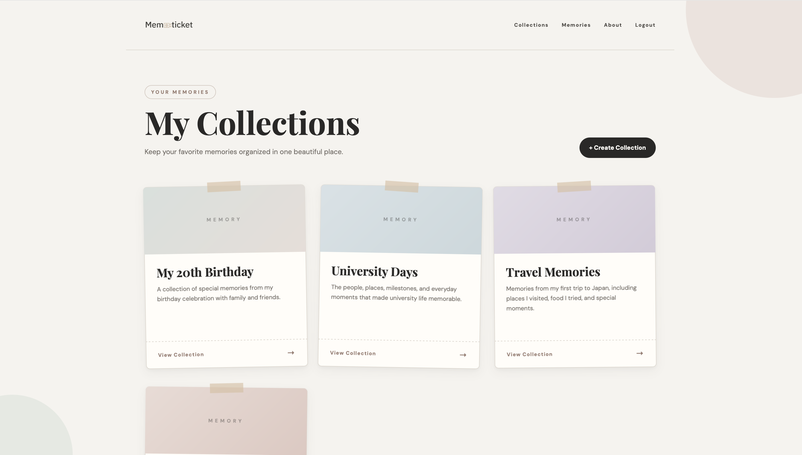
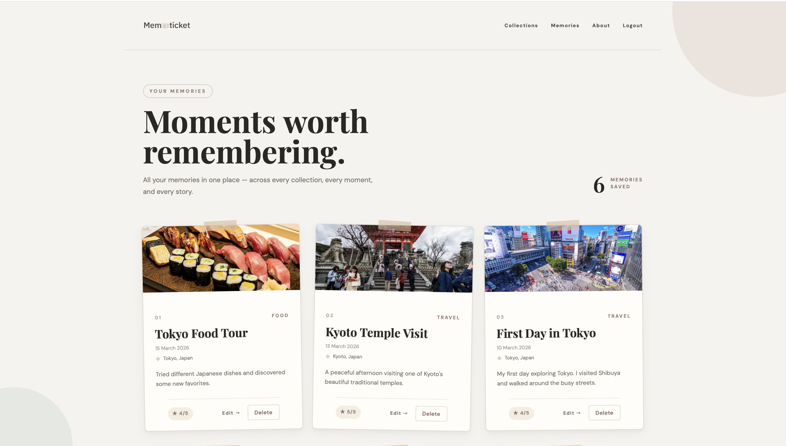
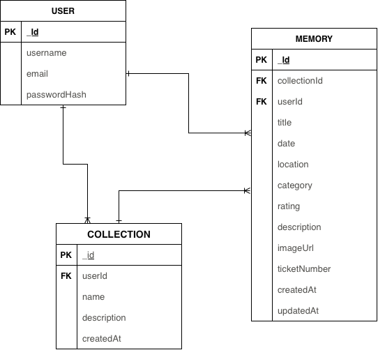

# Memoticket

<p align="center">
  
</p>

## Overview

**Memoticket** is a full-stack web application for saving and organizing special memories in a simple and meaningful way.

The idea behind Memoticket is to turn important moments into digital tickets that users can keep, organize, and revisit later.

Users can create collections and add memories to each collection with details such as the title, date, location, category, rating, description, ticket number, and image.

I built Memoticket to practice building a complete full-stack application and to apply what I learned about Express, MongoDB, authentication, CRUD functionality, RESTful routing, and deployment.

## Features

### User Authentication

* Create a new account.
* Sign in and sign out.
* Session-based authentication.
* Protected actions for signed-in users.
* Guests cannot create, update, or delete application data.

### Collections

Users can:

* Create collections.
* View collections.
* View individual collections.
* Edit collections.
* Delete collections.
* Add memories to collections.

Each collection belongs to a specific user.

### Memories

Users can:

* Create memories.
* View memories.
* View individual memories.
* Edit memories.
* Delete memories.
* Upload memory images.
* Organize memories into collections.

Each memory can contain:

* Title
* Date
* Location
* Category
* Rating
* Description
* Ticket Number
* Image

### Authorization

Users can only manage their own collections and memories.

Guests cannot access functionality that allows them to:

* Create collections
* Update collections
* Delete collections
* Create memories
* Update memories
* Delete memories

## Screenshots

### Collections Page

<p align="center">
  
</p>

### Memories Page

<p align="center">
  
</p>

## User Stories

### Authentication

* As a user, I want to create an account so that I can save my own memories.
* As a user, I want to sign in so that I can access my collections and memories.
* As a user, I want to sign out so that my account stays secure.

### Collections

* As a user, I want to create a collection so that I can organize my memories.
* As a user, I want to view my collections so that I can easily find my memories.
* As a user, I want to edit a collection so that I can update its information.
* As a user, I want to delete a collection so that I can remove collections I no longer need.

### Memories

* As a user, I want to add a memory to a collection so that I can save a special moment.
* As a user, I want to view my memories so that I can revisit my special moments.
* As a user, I want to edit a memory so that I can update its details.
* As a user, I want to delete a memory so that I can remove memories I no longer want.
* As a user, I want to upload an image with my memory so that I can visually remember the moment.
* As a user, I want to rate my memories so that I can record how special each moment was.

### Organization

* As a user, I want to organize memories into collections so that my memories are easier to manage.
* As a user, I want to see all my memories so that I can revisit them even when they belong to different collections.

### Authorization

* As a user, I want my memories and collections to be private so that other users cannot change my data.
* As a guest, I should not be able to create, edit, or delete collections and memories.

## Getting Started

### Live Application

[Memoticket](https://memoticket.onrender.com)

### Planning Materials

The application was planned before development using an ERD and wireframe.

#### ERD

<p align="center">
  
</p>


## How to Use

### 1. Create an Account

Create an account using the sign-up page.

### 2. Sign In

Sign in to access your collections and memories.

### 3. Create a Collection

Create a collection and add a name and description.

Examples:

* Travel Memories
* University
* Family Moments
* Special Days

### 4. Add a Memory

Add a memory to a collection and enter its details.

You can add:

* Memory title
* Date
* Location
* Category
* Rating
* Description
* Ticket number
* Image

### 5. Manage Your Memories

View your memories, edit their details, upload or update images, or delete memories when needed.

## Technologies Used

### Frontend

* HTML
* CSS
* EJS

### Backend

* JavaScript
* Node.js
* Express.js

### Database

* MongoDB
* MongoDB Atlas
* Mongoose

### Authentication

* Express Session
* Connect Mongo
* bcrypt

### Image Upload

* Multer
* Multer Storage Cloudinary
* Cloudinary

### Development Tools

* Git
* GitHub
* Nodemon
* Morgan
* Method Override

### Deployment

* Render

## Project Structure

```text
Memoticket/
│
├── config/
│   └── multer.js
│
├── controllers/
│   ├── authCtrl.js
│   ├── collectionsCtrl.js
│   ├── memoriesCtrl.js
│   └── pagesCtrl.js
│
├── middleware/
│   ├── addUserToViews.js
│   └── isSignedIn.js
│
├── models/
│   ├── user.js
│   ├── collection.js
│   └── memory.js
│
├── public/
│   ├── images/
│   │   ├── logo.png
│   │   ├── Screenshot1.png
│   │   ├── Screenshot2.png
│   │   ├── erd.png
│   │   └── wireframe.png
│   │
│   └── stylesheets/
│       ├── style.css
│       └── partials.css
│
├── routes/
│   ├── authRouter.js
│   ├── collectionsRouter.js
│   ├── memoriesRouter.js
│   └── pagesRouter.js
│
├── views/
│   ├── auth/
│   ├── collections/
│   ├── memories/
│   ├── pages/
│   └── partials/
│
├── .env
├── .gitignore
├── package.json
└── server.js
```

## Data Models

### User

The User model stores authentication information for each account.

```text
User
├── username
├── email
└── password
```

### Collection

Each collection belongs to a user.

```text
Collection
├── name
├── description
├── user
└── createdAt
```

### Memory

Each memory belongs to a user and a collection.

```text
Memory
├── title
├── date
├── location
├── category
├── rating
├── description
├── imageUrl
├── ticketNumber
├── user
├── collection
├── createdAt
└── updatedAt
```

## Relationships

The application uses relationships between its data entities.

```text
User
 │
 ├── has many Collections
 │
 └── has many Memories
          │
          └── belongs to Collection
```

A user can create multiple collections, and each collection can contain multiple memories.

Both collections and memories are associated with the user who created them.

## Authentication and Authorization

Memoticket uses **session-based authentication**.

When a user signs in, a session is created and used to identify the signed-in user while they navigate through the application.

Authorization protects actions that modify application data.

Guests cannot:

* Create collections
* Edit collections
* Delete collections
* Create memories
* Edit memories
* Delete memories

Users can only manage data associated with their own account.

## CRUD Functionality

Memoticket provides full CRUD functionality for its main data entities.

### Create

Users can create:

* Collections
* Memories

### Read

Users can:

* View collections
* View individual collections
* View memories
* View individual memories
* View all memories

### Update

Users can:

* Edit collections
* Edit memories

### Delete

Users can:

* Delete collections
* Delete memories

## RESTful Routing

The application follows RESTful routing conventions for its resources.

Collections and memories use resource-based routes with HTTP methods including:

* `GET`
* `POST`
* `PUT`
* `DELETE`

Method Override is used where necessary to support update and delete requests from HTML forms.

## EJS Templates

Memoticket uses **EJS templates** to render dynamic pages.

EJS is used to:

* Display user-specific information.
* Render collections and memories.
* Show different navigation options depending on authentication status.
* Display dynamic data from MongoDB.
* Reuse partial templates.

## MVC Architecture

The project follows the MVC architecture used in the course.

### Models

Models define the structure of the application's data using Mongoose.

### Views

EJS templates are used to display the application's pages to users.

### Controllers

Controllers contain the application's logic for handling requests and interacting with models.

### Routes

Routers define the application's RESTful endpoints and connect requests to the appropriate controllers.

## Environment Variables

The application uses environment variables to store sensitive configuration.

The following environment variables are required:

```text
MONGODB_URI=
SESSION_SECRET=
CLOUDINARY_CLOUD_NAME=
CLOUDINARY_API_KEY=
CLOUDINARY_API_SECRET=
```

Sensitive values are stored in environment variables and are not included in the GitHub repository.

## Running Locally

### 1. Clone the Repository

```bash
git clone https://github.com/maramsshubbar/Memoticket.git
```

### 2. Navigate to the Project

```bash
cd Memoticket
```

### 3. Install Dependencies

```bash
npm install
```

### 4. Create a `.env` File

Create a `.env` file in the project root and add:

```text
MONGODB_URI=your_mongodb_connection_string
SESSION_SECRET=your_session_secret
CLOUDINARY_CLOUD_NAME=your_cloudinary_cloud_name
CLOUDINARY_API_KEY=your_cloudinary_api_key
CLOUDINARY_API_SECRET=your_cloudinary_api_secret
```

### 5. Start the Development Server

```bash
npm run dev
```

The application will run locally on:

```text
http://localhost:3000
```

### 6. Start the Production Server

```bash
npm start
```

The production start command runs:

```text
node server.js
```

## Deployment

Memoticket is deployed online using **Render**.

### Render Configuration

**Build Command:**

```bash
npm ci
```

**Start Command:**

```bash
npm start
```

The application uses the `PORT` environment variable provided by Render and defaults to port `3000` when running locally.

```javascript
const port = process.env.PORT ? process.env.PORT : '3000';
```

### Deployment Services

The application uses:

* GitHub for source code and version control.
* Render for deployment and hosting.
* MongoDB Atlas for database hosting.
* Cloudinary for image storage.

### Deployment Flow

```text
GitHub
   │
   ▼
Render
   │
   ├── Node.js
   ├── Express
   ├── EJS
   └── Environment Variables
          │
          ├── MongoDB Atlas
          │
          └── Cloudinary
```

## Attributions

Memoticket uses the following open-source libraries and external services:

* Node.js
* Express.js
* EJS
* MongoDB Atlas
* Mongoose
* Express Session
* Connect Mongo
* bcrypt
* Multer
* Multer Storage Cloudinary
* Cloudinary
* Render

No external code or assets requiring additional attribution were intentionally used beyond the libraries and services listed above.

## Next Steps

Possible future improvements for Memoticket include:

* Add search functionality for memories.
* Add filters by category, rating, and date.
* Add sorting options.
* Add more memory categories.
* Add a user profile page.
* Add favorite memories.
* Add a timeline view for memories.
* Improve mobile responsive design.
* Add more customization options for collections.
* Improve image management.
* Add stronger validation and error handling.
* Add pagination for large collections.
* Add additional ways to organize and display memories.

## Learning Outcomes

Through this project, I learned how to:

* Build a full-stack web application.
* Build and structure an Express application.
* Use EJS templates to render dynamic pages.
* Connect an application to MongoDB.
* Create MongoDB models using Mongoose.
* Create relationships between data entities.
* Implement full CRUD functionality.
* Implement session-based authentication.
* Implement authorization.
* Use RESTful routing conventions.
* Upload images using Multer and Cloudinary.
* Organize an application using MVC architecture.
* Manage environment variables.
* Use Git and GitHub for version control.
* Deploy a full-stack application using Render.
